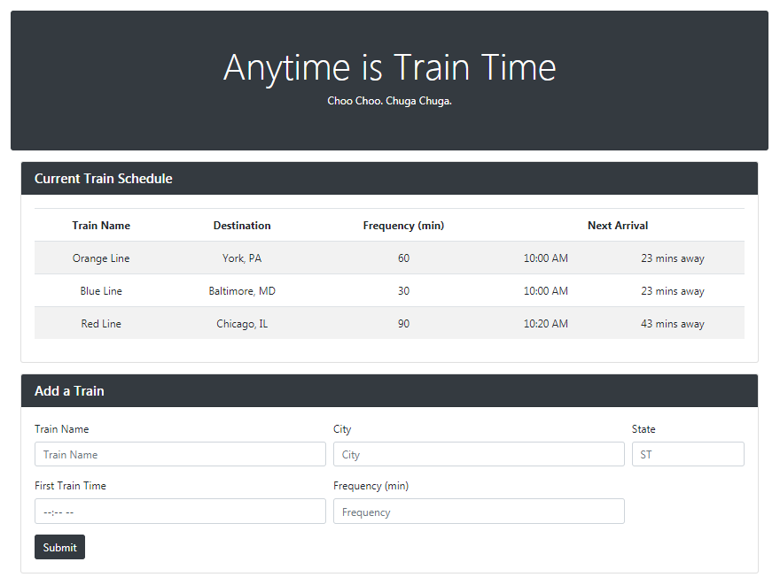

# Train Scheduler

A train schedule application that incorporates **Firebase** to host arrival and departure data. Using **Moment.js**, the schedule provides up-to-date information about various trains -- arrival times and how long until they arrive at their station.

https://dolaku.github.io/Train-Scheduler/

